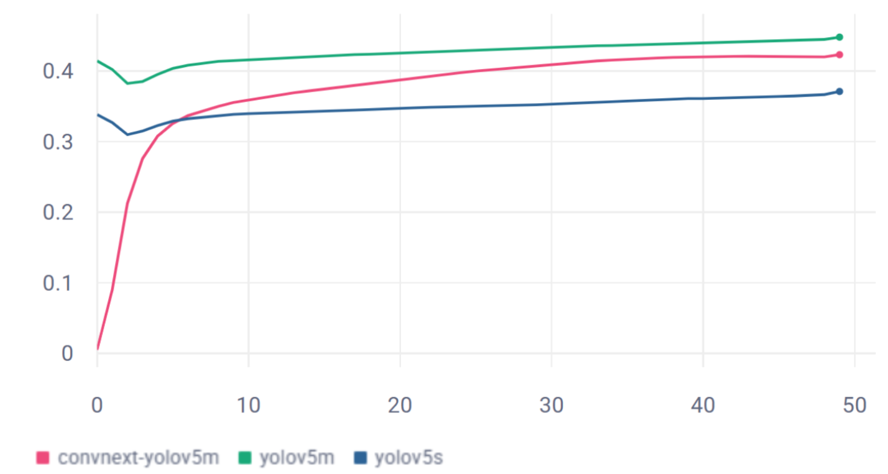
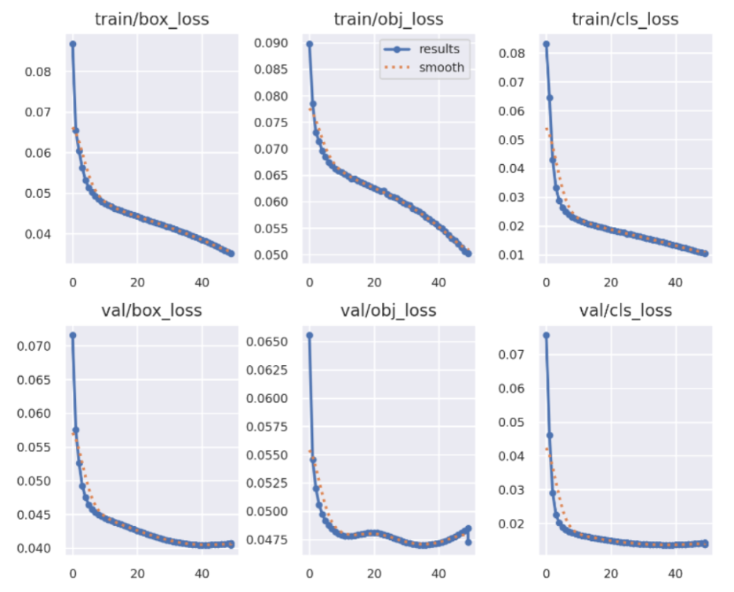

# ConvNeXt Backbones in YOLO for Object Detection

Logan Lechuga · Jared Shi · Rayan Syed · Peter Zhao
Boston University · EC523 Deep Learning Fall 2025 Project

## Overview
This project investigates whether modern ConvNeXt backbones can improve object detection performance when integrated into the YOLOv5 framework. YOLO's default CSPDarknet backbone is replaced with ConvNeXt-Tiny, leveraging improved multi-scale feature extraction, larger receptive fields, and modernized ConvNet design principles inspired by Vision Transformers.

Our goal is to evaluate whether these architectural advances improve performance on MS-COCO, particularly for small or densely packed objects, while maintaining compatibility with YOLO’s PANet neck, detection head, and loss functions.

## Motivation
YOLO models achieve real-time performance by tightly coupling a CNN backbone with a multi-scale detection head. However, the backbone limits performance on small objects due to restricted receptive fields and limited high-resolution feature representation. ConvNeXt modernizes CNNs using depthwise convolutions, inverted bottlenecks, and LayerNorm. We test whether these improve YOLO’s small-object performance.

This project explores whether replacing CSPDarknet with ConvNeXt improves YOLO's representation power while preserving its real-time architecture.

## Method

### Baselines
We benchmark against:

- YOLOv5s (7.5M params) – primary baseline
- YOLOv5m (21.2M params) – comparable model size
- ConvNeXt-YOLO (29.8M params) – our modified architecture

### Architecture
We replace the CSPDarknet backbone with a pretrained ConvNeXt-Tiny network from `timm` (pretrained on ImageNet-1k).
Three stages of ConvNeXt output features that correspond to YOLO’s required scales.

To ensure compatibility with PANet, we inject lightweight 1×1 Conv layers to map ConvNeXt channels → YOLO channels and to support YOLO’s multi-scale forward pass, we implement a Global Feature Registry storing (P3, P4, P5) until retrieval by the PANet neck.


### Dataset

We use the MS-COCO dataset containing:

- ~118,000 training images
- ~5,000 validation images
- 80 object categories with bounding box annotations
- Images resized to 640×640 pixels with standard YOLO augmentations

### Training
All models trained for 50 epochs on MS‑COCO with identical augmentations on an RTX6000 with 4 cores.

| Model | Time (hrs) |
|-------|-----------|
| YOLOv5s | 7.0 |
| YOLOv5m | 16.1 |
| ConvNeXt-YOLO | 17.5 |

## Results

### Quantitative (mAP@[0.5:0.95] over epochs)



| Model | mAP@[.5:.95] |
|-------|--------------|
| YOLOv5s | 0.3709 |
| YOLOv5m | 0.4478 |
| ConvNeXt-YOLO | 0.4229 |

ConvNeXt-YOLO outperforms YOLOv5s, satisfying the project goal.

YOLOv5m still performs best at this training schedule, suggesting ConvNeXt needs longer training or tuned hyperparameters.

### Training Curves


Our model converges smoothly in all three loss components (box, cls, obj).

## Reproduction

### Installation
```bash
git clone https://github.com/rayan-syed/ConvNeXt-YOLO
cd ConvNeXt-YOLO
pip install -r requirements.txt
```

### Training
```bash
# For baseline
python train.py --img 640 --batch 16 --epochs 50 --data coco.yaml --weights yolov5s.pt --name YOLOv5s

# For ConvNeXt-YOLO
python train.py --img 640 --batch 16 --epochs 50 --data coco.yaml --cfg models/yolov5m-convnext.yaml --weights '' --name ConvNeXt-YOLO
```

### Evaluation
With [Comet](https://www.comet.com/site/) for logging, all evaluation happens automatically after training on the validation split. The test split is not used here just like in YOLO because MS-COCO keeps test labels private.

## Project Structure

This is a fork of the official [YOLOv5 repository](https://github.com/ultralytics/yolov5) from Ultralytics with modifications to support ConvNeXt backbones.

## Logging

All training experiments are logged via [Comet](https://www.comet.com/site/) for comprehensive model evaluation and tracking.

## Conclusion
Replacing CSPDarknet with ConvNeXt-Tiny improves YOLOv5s performance on COCO, confirming that modernized ConvNet backbones can enhance multi-scale representation in single-stage detectors. While ConvNeXt did not surpass YOLOv5m under equal training budgets, architectural compatibility was demonstrated, and further gains are likely with extended training or tuned hyperparameters.
